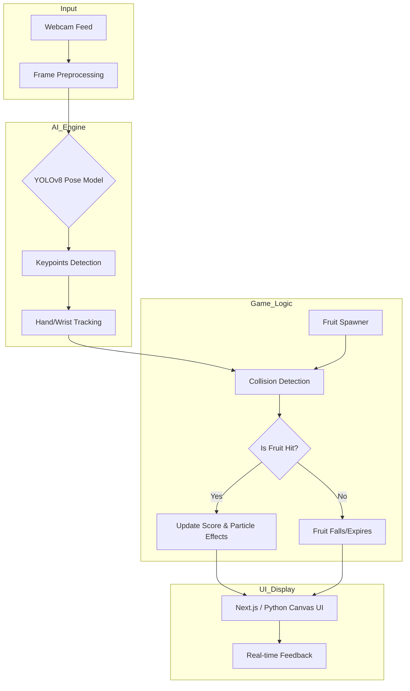

# 🍎 Ninja Fruit - AI Pose-Based Fruit Picking Game

A real-time interactive game where players "pick" or "slash" fruits using their body movements, captured via webcam and processed using **YOLOv8 Pose Detection**.

## 🚀 Overview
This project combines Computer Vision and Web Technologies to create an immersive gaming experience. It uses a Python backend for pose estimation and a Next.js frontend for the game interface (or integrated Python-based game logic).

## 🏗️ System Architecture



## 🛠️ Tech Stack
- **AI/ML:** Ultralytics YOLOv8 (Pose Estimation)
- **Backend/Logic:** Python, OpenCV
- **Frontend:** Next.js (React), TypeScript, Tailwind CSS
- **3D Assets:** FBX Models (Sword, Apple)

## 📂 Project Structure
- `main.py`: Entry point for the Python application.
- `camera.py`: Handles webcam stream and frame capture.
- `game.py`: Core game mechanics and scoring.
- `settings.py`: Configuration for AI models and game parameters.
- `web/`: Next.js web application for the browser-based interface.
- `model/`: 3D assets and pre-trained YOLOv8 weights.

## ⚙️ Installation & Setup

1. **Clone the repository:**
   ```bash
   git clone https://github.com/watcharaponthod-code/Ninja_fruit.git
   cd Ninja_fruit
   ```

2. **Install Python dependencies:**
   ```bash
   pip install -r requirements.txt
   ```

3. **Setup Web Interface (Optional):**
   ```bash
   cd web
   npm install
   npm run dev
   ```

4. **Run the game:**
   ```bash
   python main.py
   ```

## 🎮 How to Play
1. Stand in front of your webcam.
2. The AI will track your wrists/hands.
3. Move your hands to "touch" the fruits appearing on the screen.
4. Score points for every fruit you pick!

---
Developed with ❤️ by [Watcharapon](https://github.com/watcharaponthod-code)
