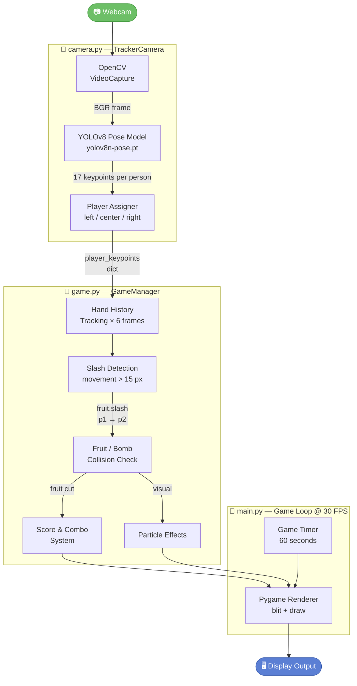
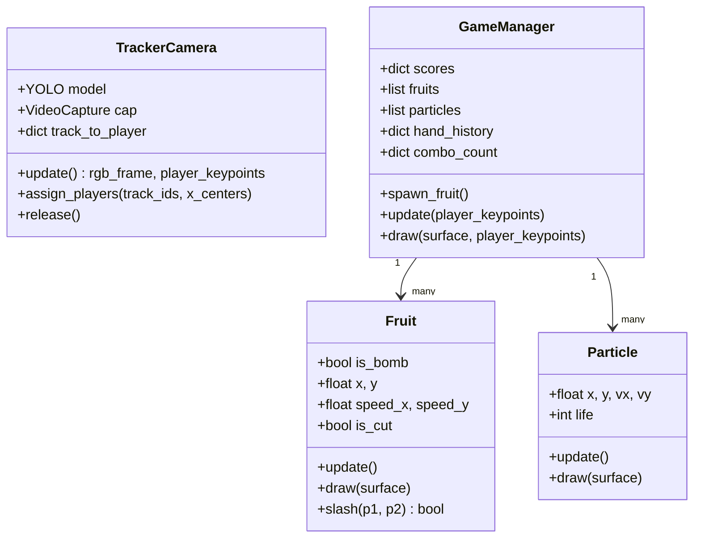

# 🍎 Ninja Fruit - AI Pose-Based Fruit Picking Game

A real-time interactive game where players slash fruits using body movements captured by webcam, processed with **YOLOv8 Pose Detection**.

---

## 🎮 Demo Video

https://github.com/watcharaponthod-code/Ninja_fruit/raw/main/demo/demo-gameplay.mp4

---

## 🧠 ML Data Flow — AI Pipeline

> แสดงการไหลของข้อมูลตั้งแต่กล้องจนถึงการแสดงผลบนจอ



### 🔍 Component Breakdown

| Component | File | Role |
|---|---|---|
| **Webcam** | — | Physical camera input |
| **OpenCV VideoCapture** | `camera.py` | Captures & mirrors each frame |
| **YOLOv8 Pose Model** | `camera.py` | Detects people → 17 COCO keypoints per person |
| **Player Assigner** | `camera.py` | Maps track IDs → Player 1/2/3 by X-position |
| **Hand History** | `game.py` | Stores last 6 wrist positions (keypoints 9 & 10) |
| **Slash Detection** | `game.py` | Triggers when hand moves > 15 px per frame |
| **Fruit/Bomb Collision** | `game.py` | Line-circle distance check between hand path & fruit |
| **Score & Combo** | `game.py` | +1 pt / fruit, combo bonus every 3 cuts, -5 for bomb |
| **Particle Effects** | `game.py` | Juice VFX on cut / explosion |
| **Game Timer** | `main.py` | 60-second countdown |
| **Pygame Renderer** | `main.py` | Composites frame + fruits + scores + timer |

---

## 🏗️ Class Architecture



---

## 🛠️ Tech Stack

| Layer | Technology |
|---|---|
| Pose Detection | YOLOv8 Nano (`yolov8n-pose.pt`) |
| Computer Vision | OpenCV (`cv2`) |
| Game Engine | Pygame |
| Tracking | YOLO built-in multi-object tracking (`persist=True`) |
| Language | Python 3 |

## 📦 Installation

```bash
pip install -r requirements.txt
python main.py
```
