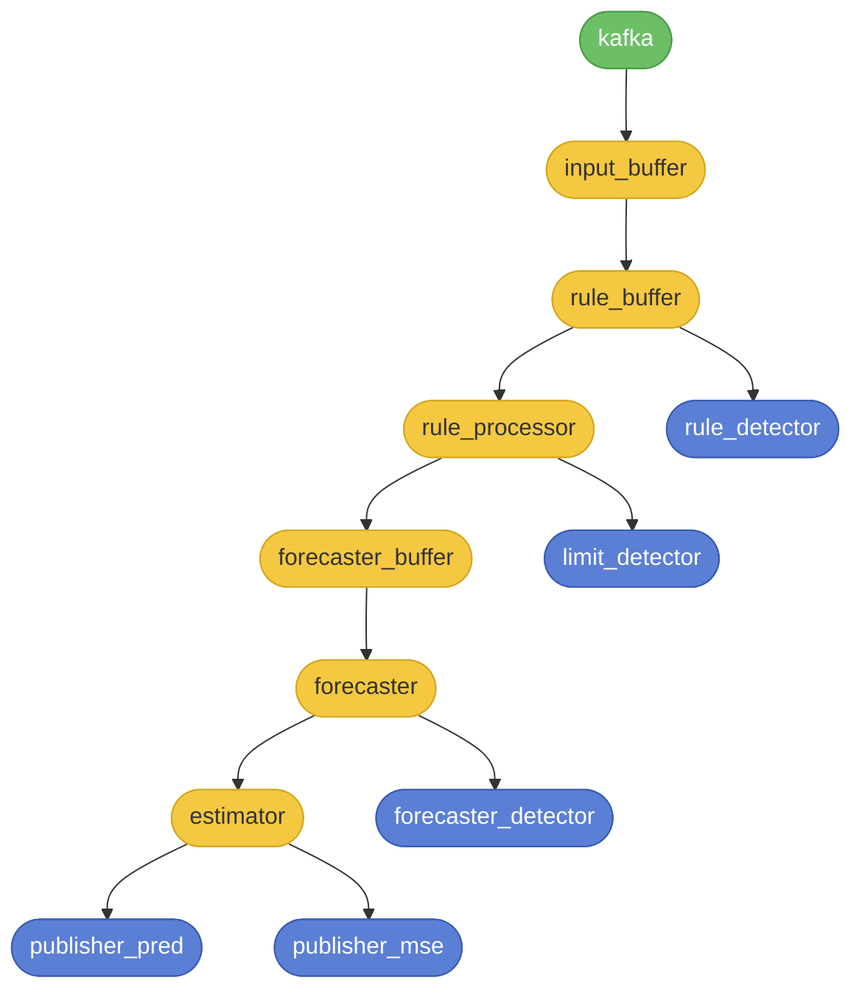
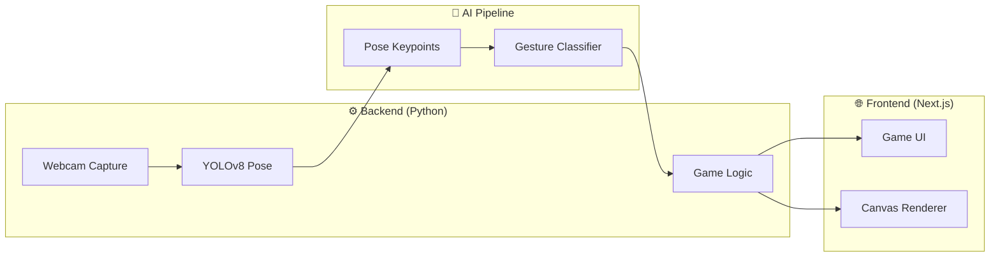

# 🍎 Ninja Fruit - AI Pose-Based Fruit Picking Game

A real-time interactive game where players "pick" or "slash" fruits using their body movements, captured via webcam and processed using **YOLOv8 Pose Detection**.

## 🎮 Demo Video

<video src="demo/demo-gameplay.mp4" controls width="100%">
  <p>Your browser doesn't support HTML video. <a href="demo/demo-gameplay.mp4">Download the video</a></p>
</video>

---

## 🚀 Overview

This project combines Computer Vision and Web Technologies to create an immersive gaming experience. It uses a Python backend for pose estimation and a Next.js frontend for the game interface (or integrated Python-based game logic).

---

## 🧠 ML Data Flow Architecture

The diagram below shows how data flows through the AI pipeline — from the **Kafka** message stream, through processing buffers and ML components, to final detection outputs.



### 🔄 Data Flow Explanation

| Component | Type | Role |
|---|---|---|
| **kafka** | Source (🟢) | Real-time data stream input from sensors/events |
| **input_buffer** | Buffer (🟡) | Receives raw Kafka events and queues them |
| **rule_buffer** | Buffer (🟡) | Buffers data for rule-based evaluation |
| **rule_processor** | Processor (🟡) | Applies business rules and filters to data |
| **forecaster_buffer** | Buffer (🟡) | Prepares time-series window for forecasting |
| **forecaster** | ML Model (🟡) | Predicts future values using trained model |
| **estimator** | ML Model (🟡) | Estimates state / refines predictions |
| **publisher_pred** | Output (🔵) | Publishes model predictions downstream |
| **publisher_mse** | Output (🔵) | Publishes Mean Squared Error metrics |
| **forecaster_detector** | Detector (🔵) | Detects anomalies in forecasted data |
| **limit_detector** | Detector (🔵) | Triggers alerts when values exceed limits |
| **rule_detector** | Detector (🔵) | Fires when rule conditions are violated |

---

## 🏗️ System Architecture



---

## 🛠️ Tech Stack

| Layer | Technology |
|---|---|
| Pose Detection | YOLOv8 Pose (`yolov8n-pose.pt`) |
| Backend | Python (`game.py`, `camera.py`, `main.py`) |
| Web Frontend | Next.js (`/web`) |
| Configuration | `settings.py` |

## 📦 Installation

```bash
pip install -r requirements.txt
python main.py
```
